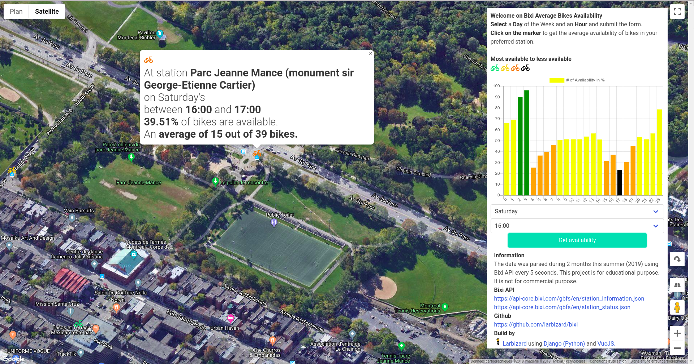

# bixi-availability

This repository id for Bixi Montreal public bikes availability tool.
Based on parsed data the tool displays available bikes on average per hour per week day.

i

## Dependencies

This projects uses both Django version 2.2.7 and VueJS

Install python dependencies using the following command

`pip install -r requirements.txt`
